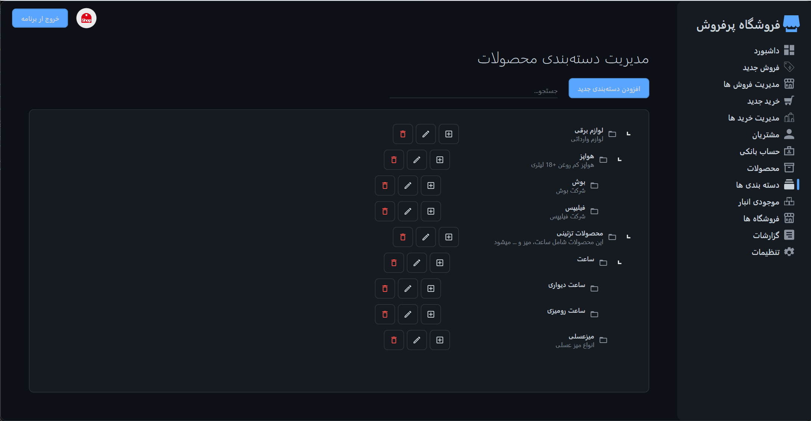
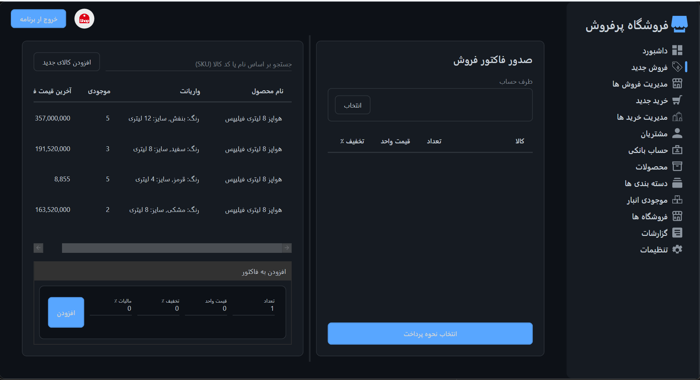
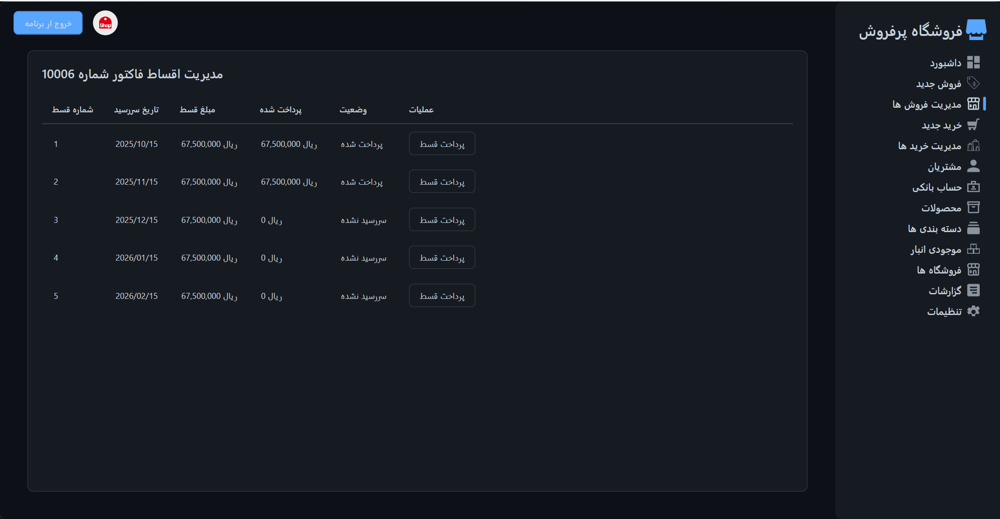

# StoreManagement | 🏪 Store Management System | سیستم مدیریت فروشگاه

[](https://github.com/YourUserName/StoreManagement/actions)  
[](LICENSE)  
[](https://github.com/YourUserName/StoreManagement/releases)

---

## 🚀 Overview | معرفی کلی

This is a full-featured **Store Management System** built using **.NET Core 9**, **WPF**, and a rich set of architectural patterns and libraries. Designed with scalability, maintainability, and clean separation of concerns in mind.

این پروژه یک سیستم کامل مدیریت فروشگاه است که با استفاده از **.NET Core 9**، **WPF** و مجموعه‌ای از الگوهای معماری مدرن طراحی شده. هدف آن ایجاد ساختاری قابل توسعه، قابل نگهداری و با جداسازی مسئولیت‌هاست.

---

## 🧠 Architecture & Technologies | معماری و تکنولوژی‌ها

| 🔧 تکنولوژی / Technology | 📌 توضیحات / Description |
|--------------------------|---------------------------|
| 🧱 **Rich Domain Model** | منطق کسب‌وکار در قلب دامنه |
| 📚 **CQRS + MediatR** | جداسازی خواندن و نوشتن + مدیریت درخواست‌ها |
| 🛢 **EF Core + Dapper** | ORM قدرتمند + دسترسی مستقیم به دیتابیس |
| 🎯 **Specifications Pattern** | فیلترهای قابل ترکیب برای کوئری‌ها |
| 🔄 **AutoMapper** | نگاشت خودکار بین DTO و مدل‌ها |
| ✅ **FluentValidation** | اعتبارسنجی تمیز و قابل تست |
| 🖼 **WPF + MVVM** | رابط کاربری مدرن با جداسازی منطقی |
| 🎨 **MaterialDesignInXamlToolkit** | طراحی متریال برای UI زیبا و مدرن |
| 🧪 **Dependency Injection** | تزریق وابستگی با Microsoft.Extensions.DependencyInjection |
| 🧩 **Dialog & Notification Abstraction** | سرویس‌های قابل تست برای دیالوگ و اعلان‌ها |
| 🧠 **Full Domain-Driven Design** | معماری کامل مبتنی بر DDD |

---

## 📸 Screenshots | تصاویر محیط برنامه *(اختیاری)*

### مدیریت تراکنش ها


### مدیریت دسته بندی ها


### فروش


### مدیریت اقساط


---

## 🛠 How to Run | نحوه اجرا

```bash
git clone https://github.com/aht9/StoreManagement.git
cd StoreManagement
# Open with Visual Studio 2022+
# Make sure SQL Server is running
# Apply EF migrations or configure Dapper connection
```

---

## 📦 Features | قابلیت‌ها

- ✅ مدیریت کالاها، مشتریان و فاکتورها
- 📊 گزارش‌گیری از فروش‌ها
- 🧠 منطق دامنه غنی و قابل تست
- 🔄 معماری CQRS برای جداسازی عملیات‌ها
- 🎨 رابط کاربری مدرن با طراحی متریال
- 🔔 سرویس‌های اعلان و دیالوگ قابل تست
- 🧪 اعتبارسنجی با FluentValidation

---

## 📄 License | مجوز

This project is licensed under the MIT License.  
این پروژه تحت مجوز MIT منتشر شده است.

---

## 📢 Release Notes | یادداشت‌های نسخه

برای ایجاد نسخه جدید (Release) در GitHub:

1. به تب **Releases** برو.
2. روی **Draft a new release** کلیک کن.
3. تگ مثل `v1.0.0` انتخاب کن.
4. عنوانی مثل "نسخه اول پایدار" بنویس.
5. این متن رو می‌تونی بذاری:

```markdown
🎉 First Stable Release - v1.0.0

✅ Rich Domain Model with full DDD architecture  
✅ CQRS with MediatR integration  
✅ EF Core + Dapper hybrid data access  
✅ FluentValidation and AutoMapper  
✅ WPF UI with Material Design  
✅ Dialog & Notification abstraction  
```


